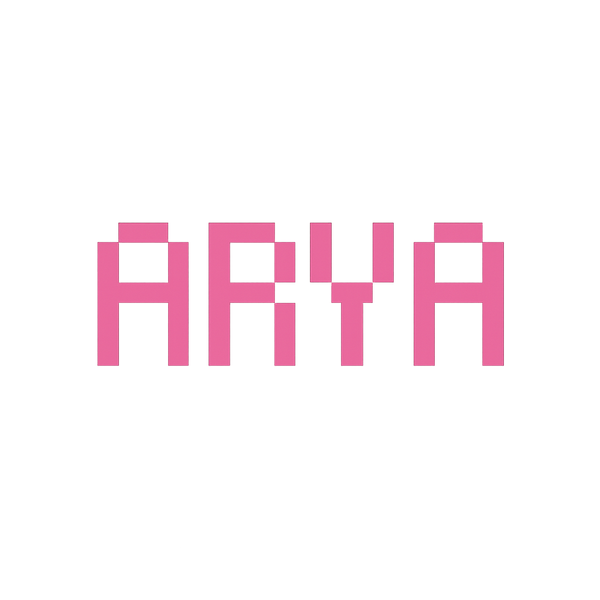
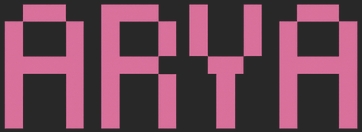

<!-- <h1 align="Center">hi  i'm   </h1>
 -->
<!-- <h1 align="center">
  hi
  
  i'm
   -->
</h1>
<h1 align="center">
  hi
  
  i'm
  
</h1>


hiiii i'm Arya, a B.Tech graduate in Electronics and Telecommunication from VJTI, Mumbai 
i'm 22 years old and looking for opportunities to build things.

↓ hit in your terminal to connect with me

```bash
npx xoaryaa
```
↑ u can find this tool at [npx xoaryaa](https://github.com/xoaryaa/npx_card)


## skills

- **Programming Languages**:   

- **Web Development**:      

- **Data Analysis**:     

- **Databases**: 

- **Tools and Platforms**:   


<!--- ## 📊 GitHub Stats

 <br>


<p></p>
-->
## connect with ME
[](https://linkedin.com/in/arya-tayshete)
[](https://instagram.com/aryatayshete)
[](mailto:avtayshete_b21@et.vjti.ac.in)


<!--- ## 🌟 Let's Innovate Together!

Feel free to explore my repositories and projects. I'm always open to collaboration and new opportunities. Let's innovate and create something amazing together!

 -->
